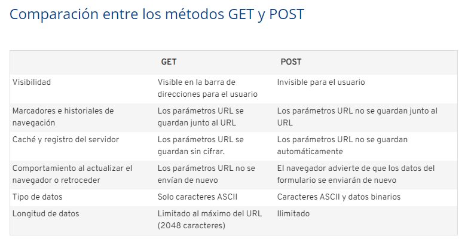

# AUTENTICACIÓN 

## Metodo Get y Post 

## Métodos de petición HTTP: GET

>Con el método GET, los datos que se envían al servidor se escriben 
>en la misma dirección URL. En la ventana del navegador, 
>lo encontrarás así:

- www.ejemplo.com/registrarse.php?nombre=pedro&amp;apellido=perez&amp;edad=55&amp;genero=hombre

### Desventajas de GET

>La mayor desventaja del método GET es su débilprotección de los datos. 
>Los parámetros URL que se envían quedan visibles en la barra de 
>direcciones del navegador y son accesibles sin clave en el historial
>de navegación, en el caché y en el log de los servidores.
      
## Métodos de petición HTTP: POST

>El método POST introduce los parámetros en la solicitud HTTP para el servidor.
>Por ello, no quedan visibles para el usuario. 
>Además, la capacidad del método POST es ilimitada.  

POST: Los parámetros URL no se guardan automáticamente 

